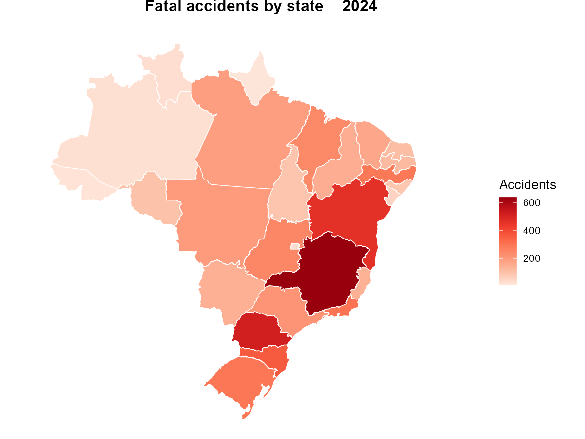

<!-- README.md is generated from README.Rmd. Please edit that file -->

# tidyprf 

<!-- badges: start -->

[](https://github.com/bonijoao/tidyprf/actions/workflows/R-CMD-check.yaml)
[](https://CRAN.R-project.org/package=tidyprf)
[](https://lifecycle.r-lib.org/articles/stages.html#experimental)
[](https://opensource.org/licenses/MIT)
<!-- badges: end -->

*[Leia em
Português](https://github.com/bonijoao/tidyprf/blob/master/README.pt-br.md)*

**tidyprf** provides access, from R, to public road safety datasets made
available by the Polícia Rodoviária Federal (PRF). These include data on
accidents by person, accidents by occurrence, and traffic violations.

The package allows users to select the desired dataset and year,
returning the data in tabular format. Files are distributed in Parquet
format via GitHub Releases and stored in a local cache after the first
download.

## Quick example

Map fatal accidents across Brazilian states in 2024:

``` r
library(tidyprf)
library(geobr)
library(dplyr)
library(ggplot2)

fatal <- get_crashes(2024, severity = "fatal") |>
  count(uf, name = "acidentes")

read_state(year = 2020, showProgress = FALSE) |>
  left_join(fatal, by = c("abbrev_state" = "uf")) |>
  ggplot() +
  geom_sf(aes(fill = acidentes), color = "white", linewidth = 0.3) +
  scale_fill_distiller(palette = "Reds", direction = 1, name = "Accidents") +
  labs(title = "Fatal accidents by state (2024)") +
  theme_void(base_size = 13) +
  theme(plot.title = element_text(hjust = 0.5, face = "bold"))
```



## Installation

Install the released version from CRAN:

``` r
install.packages("tidyprf")
```

Or the development version from GitHub:

``` r
# install.packages("remotes")
remotes::install_github("bonijoao/tidyprf")
```

## Datasets

| Dataset | Function | Unit | Available Years |
|----|----|----|----|
| Accidents by person | `get_accidents()` | 1 row per person | 2007–2026 |
| Accidents by occurrence | `get_crashes()` | 1 row per accident | 2007–2026 |
| Traffic violations | `get_violations()` | 1 row per violation | 2019–2020, 2022–2026 |

All three functions support filtering by:

- `uf` — state abbreviation(s), e.g. `"SP"`, `c("SP", "RJ")`
- `br` — federal highway number(s), e.g. `101`, `116`
- `severity` — `"fatal"`, `"injured"`, or `"no_victims"` (accidents
  only)

Use `info_accidents()`, `info_crashes()`, or `info_violations()` to see
all variable descriptions in English or Portuguese.

## Cache

Parquet files are cached locally after first download:

``` r
prf_cache()               # show cached files and sizes
prf_cache_clear()         # delete all cached files
prf_years("accidents")    # available years and row counts per dataset
```

The data repository is updated weekly with new PRF releases. When a
cached year has a newer version, it is downloaded again automatically;
offline, the cached copy is used. To turn this check off, use
`options(tidyprf.check_updates = FALSE)`.

## Data source

Raw data are published by the PRF on the [Brazilian federal government
open data
portal](https://www.gov.br/prf/pt-br/acesso-a-informacao/dados-abertos/dados-abertos-da-prf).
The consolidation pipeline that converts the raw CSV files into the
Parquet files consumed by this package lives at
[bonijoao/tidyprf-dados](https://github.com/bonijoao/tidyprf-dados).

## License

MIT
